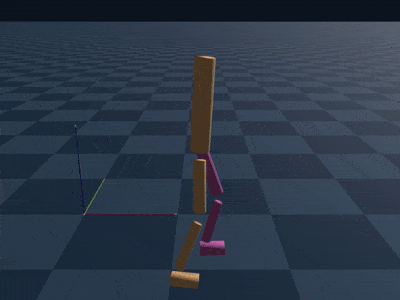

# 🦿 Legged Robotics in Genesis

A [legged_gym](https://github.com/leggedrobotics/legged_gym) based framework for training legged robots in [Genesis](https://github.com/Genesis-Embodied-AI/Genesis/tree/main) and [IsaacGym](https://developer.nvidia.com/isaac-gym)

## Table of Contents

- [🦿 Legged Robotics in Genesis](#-legged-robotics-in-genesis)
  - [Table of Contents](#table-of-contents)
  - [🌟 Features](#-features)
  - [🛠 Installation and Usage](#-installation-and-usage)
  - [🖼️ Gallery](#️-gallery)
  - [🙏 Acknowledgements](#-acknowledgements)
  - [TODO](#todo)

---

## 🌟 Features

- **Totally based on [legged_gym](https://github.com/leggedrobotics/legged_gym)**

- **Integration of 2 simulators: Genesis and IsaacGym**
  
  You can train policies in two simulators using one framework and two conda environments.

- **Incorporation of various methods in published RL papers**
  
  | Method | Paper Link | Location | Materials |
  |--------|------------|----------|-----------|
  | Periodic Gait Reward | [Sim-to-Real Learning of All Common Bipedal Gaits via Periodic Reward Composition](https://arxiv.org/abs/2011.01387) | [go2_wtw](https://github.com/lupinjia/genesis_lr/blob/main/legged_gym/envs/go2/go2_wtw/go2_wtw.py#L322) | [Comparison between smooth gait function and step gait function](https://github.com/lupinjia/genesis_lr/blob/main/test_resources/gait_reward_type/gait_reward_type.md) |
  | System Identification | [Learning Agile Bipedal Motions on a Quadrupedal Robot](https://arxiv.org/abs/2311.05818) | [go2_sysid](https://github.com/lupinjia/genesis_lr/tree/main/legged_gym/envs/go2/go2_sysid) | |
  | Teacher-Student | [Rapid Locomotion via Reinforcement Learning](https://agility.csail.mit.edu/) | [go2_ts](https://github.com/lupinjia/genesis_lr/tree/main/legged_gym/envs/go2/go2_ts) | |

## 🛠 Installation and Usage

Please refer to the [doc of this repo](https://genesis-lr.readthedocs.io/en/latest/).

## 🖼️ Gallery

| Robot | Sim | Real |
|--- | --- | --- |
| Unitree Go2 (Walk These Ways) | [video](https://www.bilibili.com/video/BV1FPedzZEdi/) | [video](https://www.bilibili.com/video/BV1FPedzZEdi/) |
| Bipedal Walker |  | |

## 🙏 Acknowledgements

- [Genesis](https://github.com/Genesis-Embodied-AI/Genesis/tree/main)
- [Genesis-backflip](https://github.com/ziyanx02/Genesis-backflip)
- [legged_gym](https://github.com/leggedrobotics/legged_gym)
- [rsl_rl](https://github.com/leggedrobotics/rsl_rl)
- [unitree_rl_gym](https://github.com/unitreerobotics/unitree_rl_gym)

## TODO

- [x] Add go2 deploy demos and instructions (2025/07/25)
- [ ] Add explicit estimator support
- [x] Add teacher-student implementation (2025/08/02)